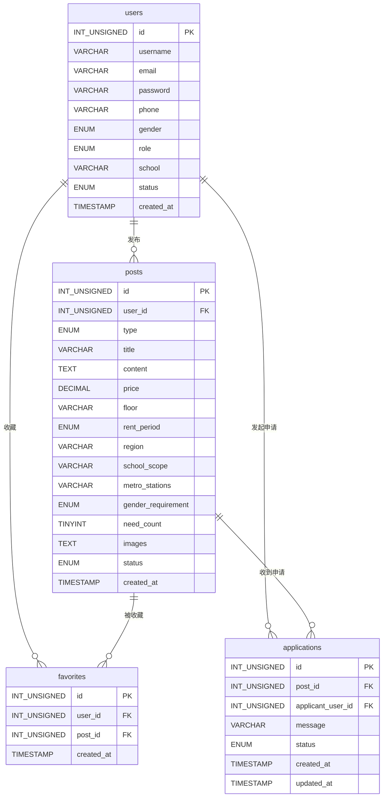

# 数据字典 — hk_rentmatch

> 本文档描述 HK Postgrad Rent-Match 项目数据库的完整结构，包括所有表、字段、枚举值、索引、外键约束及 PHP Session 结构。
>
> 数据库文件：`database.sql`（初始化） / `migrate.sql`（增量升级）

---

## 一、数据库概览

| 属性     | 值                        |
| -------- | ------------------------- |
| 数据库名 | `hk_rentmatch`            |
| 字符集   | `utf8mb4`                 |
| 排序规则 | `utf8mb4_unicode_ci`      |
| 存储引擎 | InnoDB                    |
| 当前版本 | v1.2                      |

### 表清单

| 表名           | 说明               | 行数量级 |
| -------------- | ------------------ | -------- |
| `users`        | 用户账号信息       | 千级     |
| `posts`        | 房源/室友帖子       | 万级     |
| `favorites`    | 用户收藏关系       | 万级     |
| `applications` | 帖子申请记录       | 万级     |

### 表关系（ER 图）



---

## 二、users 表

用户账号信息表，存储平台所有注册用户的基本信息与认证数据。

### 字段说明

| 列名         | 数据类型                            | 可空 | 默认值     | 说明                                          |
| ------------ | ----------------------------------- | ---- | ---------- | --------------------------------------------- |
| `id`         | `INT UNSIGNED`                      | 否   | 自增       | 主键，用户唯一标识                            |
| `username`   | `VARCHAR(50)`                       | 否   | —          | 昵称 / 显示名称                               |
| `email`      | `VARCHAR(120)`                      | 否   | —          | 登录邮箱，全局唯一                            |
| `password`   | `VARCHAR(255)`                      | 否   | —          | 密码哈希，使用 PHP `password_hash()` 生成     |
| `phone`      | `VARCHAR(30)`                       | 是   | NULL       | 手机号 / 联系方式（香港本地格式，8位，首位 2-9） |
| `gender`     | `ENUM('male','female','other')`     | 是   | `'other'`  | 性别，见枚举说明                              |
| `role`       | `ENUM('student','landlord','admin')`| 否   | `'student'`| 用户角色，见枚举说明                          |
| `school`     | `VARCHAR(120)`                      | 是   | NULL       | 所属学校，例如 `CityU`、`HKU`                 |
| `status`     | `ENUM('active','banned')`           | 否   | `'active'` | 账号状态，见枚举说明                          |
| `banned_until` | `DATETIME`                        | 是   | NULL       | 临时封禁到期时间；与 `status` 组合含义见枚举说明 |
| `created_at` | `TIMESTAMP`                         | 否   | 当前时间   | 注册时间                                      |

### 枚举值说明

**`gender`（性别）**

| 值       | 含义 |
| -------- | ---- |
| `male`   | 男   |
| `female` | 女   |
| `other`  | 其他（默认值） |

**`role`（用户角色）**

| 值         | 含义           | 权限说明                         |
| ---------- | -------------- | -------------------------------- |
| `student`  | 港硕学生       | 可发布找室友/转租帖，可收藏/申请 |
| `landlord` | 房源供给方     | 仅可发布租房帖，不可收藏/申请   |
| `admin`    | 管理员         | 后台管理（预留）                 |

**`status`（账号状态）**

| 值       | 含义 |
| -------- | ---- |
| `active` | 正常，可正常使用平台 |
| `banned` | 封禁，禁止登录       |

与 `banned_until` 的组合：`status='banned'` 且 `banned_until` 非空表示临时封禁，到期后 `login.php` 会在校验时自动将账号恢复为 `active` 并清空 `banned_until`；`status='banned'` 且 `banned_until` 为 `NULL` 表示永久封禁（不会自动解封）。当前仓库中的 `database.sql` 已包含本列；极旧库升级可依赖 `migrate.sql`。

### 索引

| 索引名      | 类型   | 字段    | 说明                 |
| ----------- | ------ | ------- | -------------------- |
| `PRIMARY`   | 主键   | `id`    | 唯一标识             |
| `uniq_email`| UNIQUE | `email` | 保证邮箱全局唯一     |

---

## 三、posts 表

帖子信息表，存储租房、有房找室友、无房找室友三种类型的帖子数据。

### 字段说明

| 列名                 | 数据类型                                   | 可空 | 默认值    | 说明                                              |
| -------------------- | ------------------------------------------ | ---- | --------- | ------------------------------------------------- |
| `id`                 | `INT UNSIGNED`                             | 否   | 自增      | 主键，帖子唯一标识                                |
| `user_id`            | `INT UNSIGNED`                             | 否   | —         | 发布者 ID，外键关联 `users.id`                    |
| `type`               | `ENUM('rent','roommate-source','roommate-nosource')` | 否 | `'rent'` | 帖子类型，见枚举说明               |
| `title`              | `VARCHAR(150)`                             | 否   | —         | 帖子标题，5–50 字                                 |
| `content`            | `TEXT`                                     | 否   | —         | 详细描述正文                                      |
| `price`              | `DECIMAL(10,2)`                            | 否   | —         | 月租金 / 月预算（HKD），范围 1000–100000          |
| `floor`              | `VARCHAR(20)`                              | 是   | NULL      | 楼层，如 `8/F`、`高层`；无房找室友类型不适用      |
| `rent_period`        | `ENUM('short','medium','long')`            | 否   | —         | 租期，见枚举说明                                  |
| `region`             | `VARCHAR(80)`                              | 否   | —         | 所在区域，如 `油尖旺区`、`沙田区`                 |
| `school_scope`       | `VARCHAR(150)`                             | 是   | NULL      | 适合的学校范围，如 `CityU`、`HKU, PolyU`          |
| `metro_stations`     | `VARCHAR(255)`                             | 是   | NULL      | 附近地铁站，逗号分隔，如 `Kowloon Tong, Diamond Hill` |
| `gender_requirement` | `ENUM('male','female','any')`              | 是   | NULL      | 性别要求；仅找室友类型使用，见枚举说明            |
| `need_count`         | `TINYINT UNSIGNED`                         | 是   | NULL      | 需求室友人数（1–10）；仅有房找室友类型使用        |
| `images`             | `TEXT`                                     | 是   | NULL      | 图片路径 JSON 数组，见格式说明；无房找室友不上传  |
| `status`             | `ENUM('active','hidden','deleted')`        | 否   | `'active'`| 帖子状态，见枚举说明                              |
| `created_at`         | `TIMESTAMP`                                | 否   | 当前时间  | 发布时间                                          |

### 枚举值说明

**`type`（帖子类型）**

| 值                  | 含义         | 适用角色   |
| ------------------- | ------------ | ---------- |
| `rent`              | 租房         | `landlord` |
| `roommate-source`   | 有房找室友   | `student`  |
| `roommate-nosource` | 无房找室友   | `student`  |

**`rent_period`（租期）**

| 值       | 含义          |
| -------- | ------------- |
| `short`  | 6 个月以下    |
| `medium` | 6 个月至 1 年 |
| `long`   | 1 年及以上    |

**`gender_requirement`（性别要求）**

| 值       | 含义       | 适用类型                              |
| -------- | ---------- | ------------------------------------- |
| `male`   | 仅限男生   | `roommate-source` / `roommate-nosource` |
| `female` | 仅限女生   | `roommate-source` / `roommate-nosource` |
| `any`    | 男女不限   | `roommate-source` / `roommate-nosource` |
| NULL     | 不适用     | `rent`                                |

**`status`（帖子状态）**

| 值        | 含义                             |
| --------- | -------------------------------- |
| `active`  | 上架，正常展示                   |
| `hidden`  | 隐藏，不展示（预留，供下架使用） |
| `deleted` | 已删除（软删除，保留记录）        |

### images 字段格式

存储为 JSON 数组字符串，数组元素为相对于项目根目录的路径（也兼容逗号分隔格式作为降级解析）。

```json
["uploads/posts/20240101_abc123.jpg", "uploads/posts/20240101_def456.png"]
```

- 最多 3 张图片
- 单张不超过 5 MB
- 支持格式：JPG / PNG / WEBP / GIF
- 文件实际存储路径：`uploads/posts/<日期时间>_<随机8字节hex>.<ext>`
- `roommate-nosource` 类型不支持上传，此字段为 NULL

### 各字段与帖子类型的对应关系

| 字段                 | `rent` | `roommate-source` | `roommate-nosource` |
| -------------------- | :----: | :---------------: | :-----------------: |
| `title`              | 必填   | 必填              | 必填                |
| `content`            | 必填   | 必填              | 必填                |
| `price`              | 必填（月租金，上限 100000）| 必填（月租金，上限 100000）| 必填（月预算，上限 50000）|
| `floor`              | 必填   | 必填              | 不适用（NULL）      |
| `rent_period`        | 必填   | 必填              | 必填                |
| `region`             | 必填   | 必填              | 必填                |
| `school_scope`       | 选填   | 选填              | 选填                |
| `metro_stations`     | 必填   | 必填              | 必填                |
| `gender_requirement` | 不适用 | 必填              | 必填                |
| `need_count`         | 不适用 | 必填（1–10）      | 不适用（NULL）      |
| `images`             | 选填   | 选填              | 不适用（NULL）      |

### 索引

| 索引名            | 类型   | 字段           | 说明                       |
| ----------------- | ------ | -------------- | -------------------------- |
| `PRIMARY`         | 主键   | `id`           | 唯一标识                   |
| `idx_region`      | 普通   | `region`       | 按区域筛选                 |
| `idx_school_scope`| 普通   | `school_scope` | 按学校范围筛选             |
| `idx_price`       | 普通   | `price`        | 按价格排序/筛选            |
| `idx_rent_period` | 普通   | `rent_period`  | 按租期筛选                 |
| `idx_status`      | 普通   | `status`       | 过滤上架/下架状态（高频）  |

### 外键约束

| 约束名          | 本表字段  | 关联表/字段  | 删除行为    | 更新行为    |
| --------------- | --------- | ------------ | ----------- | ----------- |
| `fk_posts_user` | `user_id` | `users.id`   | CASCADE     | CASCADE     |

> 用户被删除时，其所有帖子同步级联删除。

---

## 四、favorites 表

用户收藏关系表，记录用户对帖子的一对多收藏行为；通过联合唯一索引防止重复收藏。

### 字段说明

| 列名         | 数据类型       | 可空 | 默认值   | 说明                          |
| ------------ | -------------- | ---- | -------- | ----------------------------- |
| `id`         | `INT UNSIGNED` | 否   | 自增     | 主键，收藏记录唯一标识        |
| `user_id`    | `INT UNSIGNED` | 否   | —        | 收藏用户 ID，外键关联 `users.id` |
| `post_id`    | `INT UNSIGNED` | 否   | —        | 被收藏帖子 ID，外键关联 `posts.id` |
| `created_at` | `TIMESTAMP`    | 否   | 当前时间 | 收藏时间                      |

### 索引

| 索引名                 | 类型   | 字段                | 说明                       |
| ---------------------- | ------ | ------------------- | -------------------------- |
| `PRIMARY`              | 主键   | `id`                | 唯一标识                   |
| `uniq_user_post`       | UNIQUE | `user_id`,`post_id` | 防止同一用户重复收藏同一帖子 |
| `idx_favorites_user_id`| 普通   | `user_id`           | 按用户查询收藏列表         |
| `idx_favorites_post_id`| 普通   | `post_id`           | 按帖子统计收藏数           |

### 外键约束

| 约束名              | 本表字段  | 关联表/字段 | 删除行为 | 更新行为 |
| ------------------- | --------- | ----------- | -------- | -------- |
| `fk_favorites_user` | `user_id` | `users.id`  | CASCADE  | CASCADE  |
| `fk_favorites_post` | `post_id` | `posts.id`  | CASCADE  | CASCADE  |

> 用户或帖子被删除时，相关收藏记录同步级联删除。

---

## 五、applications 表

帖子申请记录表，记录学生对帖子发起的申请、留言与处理状态流转。

### 字段说明

| 列名                | 数据类型                                               | 可空 | 默认值      | 说明                               |
| ------------------- | ------------------------------------------------------ | ---- | ----------- | ---------------------------------- |
| `id`                | `INT UNSIGNED`                                         | 否   | 自增        | 主键，申请记录唯一标识             |
| `post_id`           | `INT UNSIGNED`                                         | 否   | —           | 申请目标帖子 ID，外键关联 `posts.id` |
| `applicant_user_id` | `INT UNSIGNED`                                         | 否   | —           | 申请人用户 ID，外键关联 `users.id` |
| `message`           | `VARCHAR(500)`                                         | 是   | NULL        | 申请留言                           |
| `status`            | `ENUM('pending','accepted','rejected','withdrawn')`    | 否   | `'pending'` | 申请状态，见枚举说明               |
| `owner_unread`      | `TINYINT(1)`                                           | 否   | `0`         | 房主尚未进入「收到申请」分区看过本条新申请时为 `1`，用于红点/未读计数 |
| `applicant_result_unread` | `TINYINT(1)`                                     | 否   | `0`         | 申请人尚未进入「我的申请」分区看到本条被同意/拒绝时为 `1` |
| `created_at`        | `TIMESTAMP`                                            | 否   | 当前时间    | 申请创建时间                       |
| `updated_at`        | `TIMESTAMP`                                            | 否   | 当前时间    | 状态更新时间（自动更新）           |

### 枚举值说明

**`status`（申请状态）**

| 值          | 含义           | 说明                             |
| ----------- | -------------- | -------------------------------- |
| `pending`   | 待处理         | 新提交申请，等待帖子发布者处理   |
| `accepted`  | 已同意         | 帖子发布者已同意申请             |
| `rejected`  | 已拒绝         | 帖子发布者已拒绝申请             |
| `withdrawn` | 已撤回         | 申请人主动撤回申请               |

### 索引

| 索引名                            | 类型 | 字段                | 说明                         |
| --------------------------------- | ---- | ------------------- | ---------------------------- |
| `PRIMARY`                         | 主键 | `id`                | 唯一标识                     |
| `idx_applications_post_id`        | 普通 | `post_id`           | 按帖子查看收到的申请         |
| `idx_applications_applicant_user_id` | 普通 | `applicant_user_id` | 按申请人查看我发出的申请     |
| `idx_applications_status`         | 普通 | `status`            | 按状态筛选（待处理/已处理）  |
| `idx_applications_applicant_result_unread` | 普通 | `applicant_user_id`, `applicant_result_unread` | 按申请人统计结果未读条数     |

### 外键约束

| 约束名                          | 本表字段             | 关联表/字段 | 删除行为 | 更新行为 |
| ------------------------------- | -------------------- | ----------- | -------- | -------- |
| `fk_applications_post`          | `post_id`            | `posts.id`  | CASCADE  | CASCADE  |
| `fk_applications_applicant_user`| `applicant_user_id`  | `users.id`  | CASCADE  | CASCADE  |

> 用户或帖子被删除时，相关申请记录同步级联删除。

---

## 六、PHP Session 结构

登录成功后，`includes/auth.php` 的 `login_user()` 函数将以下字段写入 `$_SESSION['user']`。

| 键名       | 来源字段       | 说明                        |
| ---------- | -------------- | --------------------------- |
| `id`       | `users.id`     | 用户主键                    |
| `username` | `users.username` | 昵称                      |
| `email`    | `users.email`  | 登录邮箱                    |
| `role`     | `users.role`   | 角色（`student`/`landlord`/`admin`） |
| `school`   | `users.school` | 所属学校                    |
| `gender`   | `users.gender` | 性别                        |
| `status`   | `users.status` | 账号状态                    |

> 判断是否已登录：`isset($_SESSION['user']['id'])`
>
> 登出时通过 `logout_user()` 清空 Session 并销毁 Cookie。

---

## 七、数据库变更记录

| 版本 | 文件            | 变更内容                                                                                  |
| ---- | --------------- | ----------------------------------------------------------------------------------------- |
| v1.0 | `database.sql`  | 初始建库：创建 `users`、`posts` 表，插入示例数据                                         |
| v1.1 | `migrate.sql`   | `posts.type` ENUM 扩充 `roommate-source`、`roommate-nosource` 两个枚举值（修复旧表兼容）  |
| v1.1 | `migrate.sql`   | 新增 `posts.gender_requirement` 字段（性别要求，找室友类型使用）                          |
| v1.1 | `migrate.sql`   | 新增 `posts.need_count` 字段（需求室友人数，有房找室友类型使用）                          |
| v1.2 | `migrate.sql`   | 新增 `favorites` 表（用户收藏关系、联合唯一约束、索引与外键）                            |
| v1.2 | `migrate.sql`   | 新增 `applications` 表（申请状态流转、索引与外键）                                       |
| v1.3 | `migrate.sql`   | `applications` 增加 `owner_unread`、`applicant_result_unread`（申请/收到申请未读提醒）及复合索引 `idx_applications_applicant_result_unread` |
